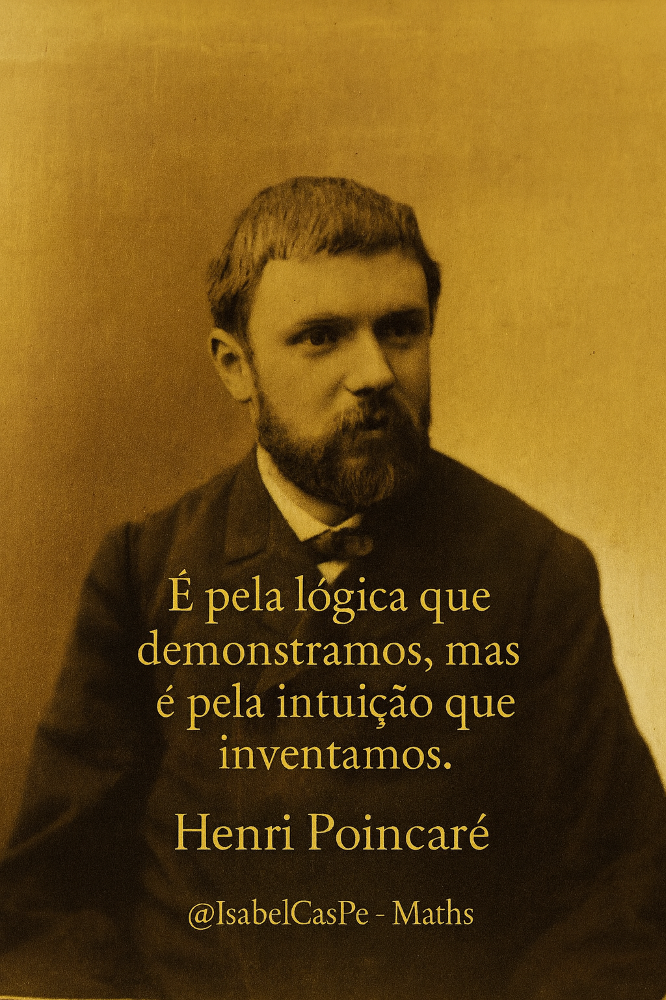
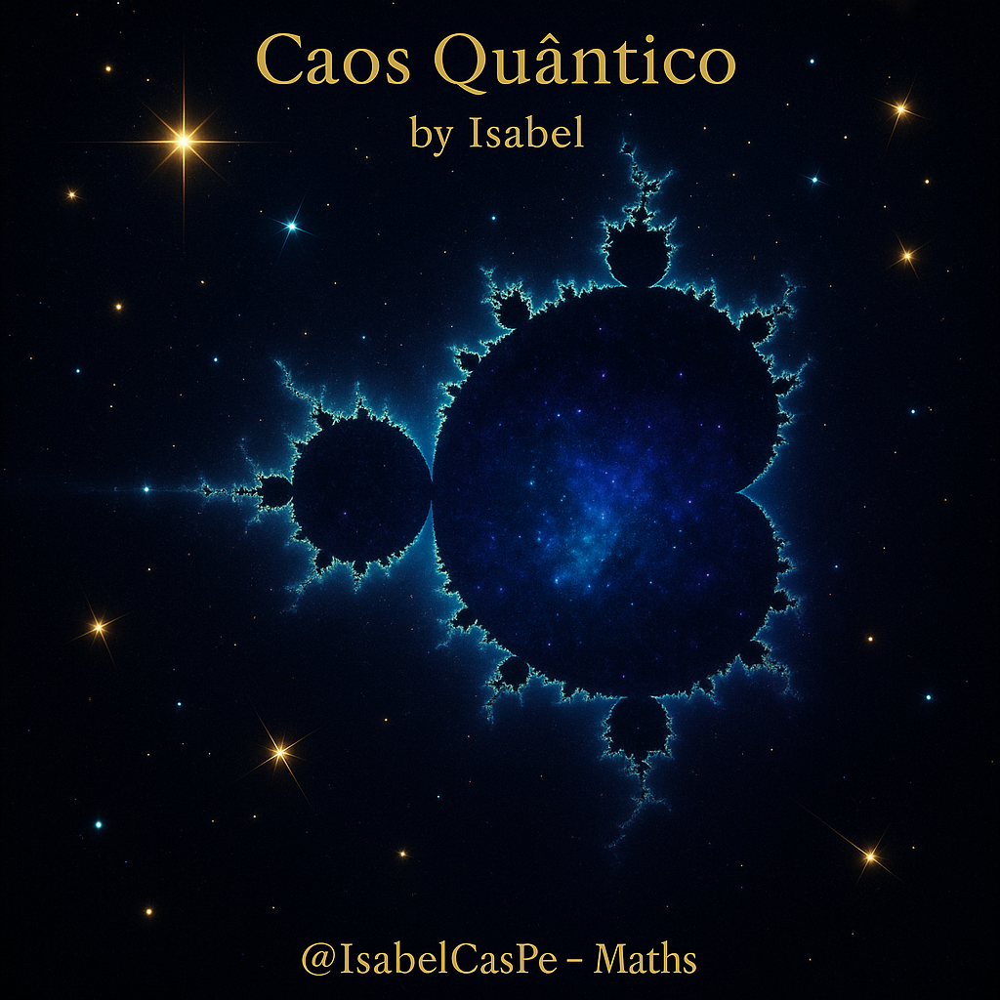

<!-- HERO -->
# Arte & Ciência em Movimento - Matemática Viva 💎🧮✨ 

 

<p align="center">
  <a href="https://www.amazon.com.br/descoberta-dos-n%C3%BAmeros-aventura-matem%C3%A1tica/dp/6584835553"> 
    
  </a>
  <br>
  <sub><em>✨ Recomendado por <strong>@IsabelCasPe</strong> · Applied Mathematics ♾️ 💎</em></sub>  
  <br>
   
   
   
</p>

<p align="center">
  
</p>

<p align="center">
  <sub><b>@IsabelCasPe</b> 💙✨ - <i>Cosmos em código: ciência que vira arte.</i> 💎♾️</sub>
</p>


  


 

---

[](https://teses.usp.br/teses/disponiveis/3/3151/tde-20102010-122044/en.php)
[](https://arxiv.org/abs/2504.01969)

---

## 🌌 Sistemas Dinâmicos: Matemática, Finanças e Caos

Bem-vindo ao meu repositório de **Sistemas Dinâmicos**, onde exploro a beleza da matemática aplicada a finanças, física, biologia e além! 🌟 Aqui, você vai encontrar uma jornada de aprendizado com slides, simulações em Python e visualizações que conectam equações diferenciais, caos e aplicações reais, como volatilidade de mercados (ex.: GOLL4.SA) e epidemias (ex.: COVID-19). Inspirado por grandes como Marcelo V., esse projeto é pra quem quer mergulhar no imprevisível e no *diferencial*! 😎

- Física (ex.: órbitas planetárias, oscilações mecânicas)
- Biologia (ex.: crescimento populacional, epidemiologia)
- Economia e Finanças (ex.: modelos de ciclos econômicos, volatilidade de mercados)
- Engenharia (ex.: controle de sistemas, circuitos elétricos)
---
## Multimode Photon – 37 Quantum Degrees of Freedom
Representação animada de um fóton codificado simultaneamente em múltiplas dimensões (phase, color, spatial modes).
Inclui:
• efeitos de coerência, pulsos de intensidade
• anéis oscilatórios representando modos acoplados
• background estelar com ruído pseudoaleatório
• overlay do Loki como “observer effect” felino

Ideal para visualização educacional e experimentos de estética científica. @IsabelCasPe – Maths ∞ 😎
- 
  
---

## A pseudoesfera só gira assim quando percebe que alguém está realmente prestando atenção.
Modelos hiperbólicos fazem isso: distorcem espaço, tempo… e às vezes a sanidade de quem assiste. 😏
- 
  
---
## Uma pseudosfera girando, um μ estabilizando e um universo que se recusa a colapsar.
- 

---  

## Evolução dos GIFs: Porque professor que não refaz… não existe. Aqui estão as versões 5 → 7 → 8 esferas. Matemática é iteração. Visualização também. 🌀
- 
  
---

## Loki Rei dos Sistemas Dinâmicos: meu Loki ganhou suas esferas quânticas! girando em órbita 🪐 periódica, como um pequeno sistema dinâmico felino.  
🧶🐈‍⬛👑✨♾️
- 

---

## 🌀🔬 Conjunto de Mandelbrot em zoom contínuo: iteramos 𝑧_𝑛+1={𝑧_𝑛}^2 +C e mapeamos cores pelo tempo de escape. O interior permanece limitado; as bordas revelam estruturas sem fim. ♾️


---
## 📚 Capítulos   

Uma série de apresentações em LaTeX (Beamer) que cobrem desde os fundamentos até aplicações práticas, com exemplos reais e gráficos incríveis!

1. **Introdução a Sistemas Dinâmicos** ([slides](Cap1Introduction.pdf))  
   - Visão geral do campo, com motivação financeira e interdisciplinar.
2. **Equações Diferenciais Ordinárias (EDOs)** ([slides](cap2EDOs.pdf))  
   - Fundamentos de EDOs com aplicações em crescimento de portfólios.
3. **Estabilidade de Equilíbrios** ([slides](cap3EstabilidadeEquilibrios.pdf))  
   - Análise de estabilidade com exemplo em preços de mercado.
4. **Sistemas Não Lineares** ([slides](cap4SistemasnãoLineares.pdf))  
   - Bifurcações e caos, com volatilidade caótica em finanças.
5. **Análise Qualitativa e Retratos de Fase** ([slides](cap5AnalisisQuantitativos.pdf))  
   - Visualização de dinâmicas, com oferta e demanda em mercados.
6. **Aplicações Práticas em Física, Biologia e Finanças** ([slides](cap6AplicaçoesPraticas.pdf))  
   - Modelos como pêndulo amortecido, SIR e Black-Scholes simplificado.
7. **Simulações Numéricas e Visualizações em Python** ([slides](cap7SimulaçaoNumerica.pdf))  
   - Métodos Euler e RK4, com simulações de volatilidade e epidemias.  
   - Códigos: [Mapa Logístico](MapLogistic.ipynb), [Modelo SIR](sistema_de_Lorenz.ipynb)

## 🐍 Simulações e Visualizações em Python

Notebooks Jupyter que trazem os sistemas dinâmicos à vida com gráficos. 🎨

- **Autômato Celular** ([Autômato_Celular.ipynb](Autômato_Celular.ipynb))  
  - Simulação do Jogo da Vida, um clássico dos autômatos celulares.
- **Efeito Borboleta** ([EquationLorenz.ipynb](EquationLorenz.ipynb))  
  - Visualização do atractor de Lorenz, com sensibilidade às condições iniciais.
- **Conjunto de Julia** ([IteraçaoJulia.ipynb](IteraçaoJulia.ipynb))  
  - Exploração do fractal de Julia, conectando com caos.
- **Mapa Logístico** ([MapLogistic.ipynb](MapLogistic.ipynb))  
  - Simulação do mapa logístico, modelando volatilidade financeira.
- **Bifurcações** ([MapaLogisticoBifurcaçoes.ipynb](MapaLogisticoBifurcaçoes.ipynb))  
  - Diagrama de bifurcação do mapa logístico, mostrando a transição pro caos.
- **Pêndulo Simples** ([Pendulo.ipynb](Pendulo.ipynb))  
  - Simulação de um pêndulo amortecido, com aplicações em física.
- **Pêndulo Duplo** ([PenduloDuplo.ipynb](PenduloDuplo.ipynb))  
  - Dinâmica caótica de um pêndulo duplo.
- **Sistema de Lorenz** ([sistema_de_Lorenz.ipynb](sistema_de_Lorenz.ipynb))  
  - Simulação numérica do sistema de Lorenz, com gráficos 3D.

## 🎥 Recursos Extras

- **Vídeo: Risco Sistêmico Irã 2025** ([systemic_risk_iran_crisis_v20.mp4](videos/systemic_risk_iran_crisis_v20.mp4))  
- Animação explorando risco financeiro em crises globais (em breve no repositório!).
- **Site Pessoal**: [isabelcaspe.github.io](https://isabelcaspe.github.io/)  
- Confira mais projetos e minha jornada na matemática e finanças!

---

## 🌟 *Math Moments*  

<p align="center">
  <a href="https://www.amazon.com.br/descoberta-dos-n%C3%BAmeros-aventura-matem%C3%A1tica/dp/6584835553">
    
  </a>
</p>

<p align="center">
  <em>✨ Recomendado por <strong>@IsabelCasPe</strong> · Applied Mathematics ♾️ 💎</em><br>
  <sub>“Quando a matemática inspira, até os fractais brindam.” 🥂</sub>
</p>


**Encontros que inspiram - onde a matemática celebra a vida.**


📘 **A Descoberta dos Números** - *Marcelo Vianna*  
> “Os números não são apenas ferramentas: são janelas para entender o universo.”  

✨ No lançamento de *A Descoberta dos Números*, um brinde à beleza da Matemática - entre ideias, sorrisos e taças de champagne 🥂.  
Foi mais que um evento: **foi a celebração do pensamento em sua forma mais pura.**  
Porque, no fim, **a matemática também é feita de encontros e alegria.** 💎♾️  

📸 *“Entre fractais e brindes, a ciência também dança.”*  
> 💙 @IsabelCasPe - *Applied Mathematics & Quantum Vibes* 🌌  

[📘 Comprar o livro na Amazon](https://www.amazon.com.br/descoberta-dos-n%C3%BAmeros-aventura-matem%C3%A1tica/dp/6584835553)  

## Henri Poincaré 
- 
  
---
  

## 🚀 Como Usar

1. **Slides**: Baixe os PDFs dos capítulos e mergulhe nos conceitos com exemplos reais.
2. **Notebooks**: Rode os `.ipynb` no Jupyter Notebook ou Google Colab pra interagir com as simulações.
3. **Contribua**: Tem ideias? Abre uma issue ou pull request no GitHub! 

## 📖 Referências

Este repositório é inspirado no trabalho pioneiro de **Marcelo Viana**, que colocou o Brasil no mapa dos sistemas dinâmicos com contribuições em caos e teoria ergódica. Confira seus livros pra mergulhar mais fundo:

- Viana, M., & Espinar, J. (2021). *Differential Equations: A Dynamical Systems Approach to Theory and Practice*. American Mathematical Society. [Comprar](https://www.amazon.com.br/Differential-Equations-Dynamical-Approach-Mathematics/dp/147046540X)
- Viana, M., & Oliveira, K. (2016). *Foundations of Ergodic Theory*. Cambridge University Press. [Comprar](https://www.amazon.com.br/Foundations-Ergodic-Theory-Marcelo-Viana/dp/1107126967)
- Viana, M., & Oliveira, K. (2014). *Fundamentos da Teoria Ergódica*. Sociedade Brasileira de Matemática. [Comprar](https://www.sbm.org.br/loja) ou confira no [IMPA](https://w3.impa.br) pra possíveis downloads.
- Strogatz, S. H. (2014). *Nonlinear Dynamics and Chaos*. Westview Press.
- Hirsch, M. W., Smale, S., & Devaney, R. L. (2013). *Differential Equations, Dynamical Systems, and an Introduction to Chaos*. Academic Press.
- Hale, J. K. (2009). *Ordinary Differential Equations*. Dover Publications.

## 📬 Contato

- **GitHub**: [isabelcaspe](https://github.com/isabelCasPe)
- **X**: Siga-me em [X](https://x.com/anacp20) pra atualizações sobre caos e finanças! 🦋

© Ana Isabel C., 2025. Feito com 💛 pra quem ama aprender!

**Próxima Sessão**: Continue explorando sistemas dinâmicos e aplique em projetos reais! 😜
  

> Este repositório está em constante atualização, conforme novos tópicos e aplicações forem sendo estudados.

----
## Galeria de Dinâmicas Fractais 💫 ♾️



---

## Inspiration.
 
> “O caos é onde a matemática encontra a beleza da imprevisibilidade.” By: Artur Avila

> "Nos redemoinhos da complexidade, os sistemas dinâmicos revelam padrões ocultos @Sistemas-Dinamicos onde o tempo mostra a geometria do caos." ⏳📈🌀🔄📊
> Copyright © 2025 Prof. Ana Isabel C. 💙

---
## Instalação · Installation · Instalación
```bash

python -m venv .venv && source .venv/bin/activate
pip install -r requirements.txt
python main.py
